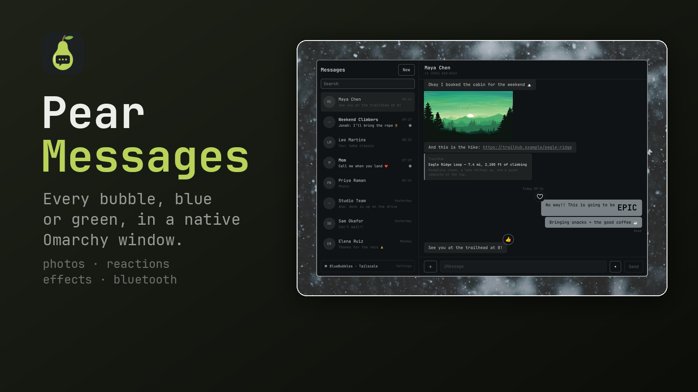
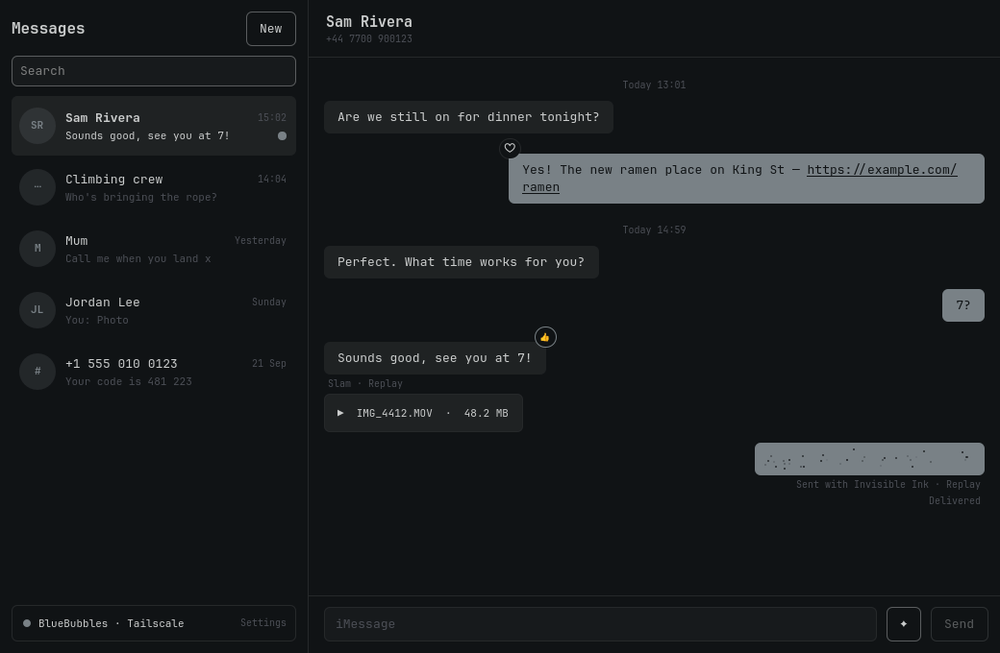

# Pear Messages

Every bubble, blue or green, in a native Omarchy window.



Pear Messages reaches your conversations two ways and shows them as one:

- **BlueBubbles**: a Mac signed in to Messages, running the free
  [BlueBubbles Server](https://bluebubbles.app). Your full history, group chats, photos and
  videos, reactions, effects, delivered and read.
- **Your iPhone over Bluetooth**: no Mac needed. New messages arrive the moment they come
  in, and you can reply to one-to-one chats. Your iPhone decides whether each one goes as
  iMessage or SMS.

When the Mac can be reached, Pear Messages uses BlueBubbles. When it can't, because the Mac
is asleep, off or away, it falls back to your iPhone. A message that arrives both ways shows
once.



> Pear Messages is an independent project. It is not made, endorsed or supported by Apple.
> iMessage, iPhone and Mac are Apple's trademarks, used here only to say what this works with.

## What it does

**Your conversations**
- **One history from two connections.** Each message is recognised by who sent it, which way
  it went, its text and when. The copy that arrives second is merged into the first, even
  when the iPhone has cut a long text short. When BlueBubbles catches up after time away, the
  messages that came over Bluetooth gain their photos, reactions and effects.
- **One conversation per person.** Your own number and email are one conversation, and each
  message you send yourself shows once. A contact with several numbers or emails on one card
  is one conversation too.
- **History on demand.** By default your 20 most recent conversations bring their last 100
  messages and the rest their last 20. Pull past the top of a conversation for 100 more.
- **Photos, videos and files.** Previews load as messages come into view: photos resized on the
  Mac, videos as a thumbnail frame. The originals download only when you open them. Press Space
  (or double-click) to preview in GNOME's previewer, Sushi, or a built-in viewer.
- **Link previews.** A link shows its site, title and description, as text only, fetched when
  the message comes into view. Links to your own network are never fetched: the address is
  checked once and the connection is pinned to that exact address, so a sender cannot answer
  with a public address for the check and a private one for the fetch.
- **Reactions and effects.** Hover a message and press ☺ to react ♥ 👍 👎 😂 ‼ ?. ✦ next to
  Send picks an effect: bubble effects (Slam, Loud, Gentle, Invisible Ink), text effects (Big,
  Small, Shake, Nod, Explode, Ripple, Bloom, Jitter) and screen effects (Confetti, Balloons,
  Fireworks, Lasers, Love, Celebration, Echo, Spotlight, Shooting Star). Received effects play as
  they arrive, and "Happy birthday", "Congrats", "Happy New Year" and friends play their effect
  in several languages. Sending reactions and effects needs BlueBubbles' Private API. When
  that isn't available, the controls are greyed out and say why.
- **Reactions that arrive as text** over Bluetooth ("Loved “…”", or the same in French,
  Spanish, German…) become real reactions.

**Sending**
- **Send photos and files.** Use ＋, drop them on the window or paste an image. They go through
  BlueBubbles, with any text after them.
- **Messages wait instead of failing.** A message that can't go yet says what it's waiting for
  ("Sends when BlueBubbles connects") and sends itself when it can, with Send now and Cancel.
  If the Mac is reachable but Messages there isn't sending, Pear Messages reads BlueBubbles' log
  and tells you what to fix.
- **Falls back without double-sending.** Plain text goes through your iPhone when the Mac can't
  take it. If BlueBubbles only timed out, Pear Messages first checks whether the Mac sent it
  anyway.
- **Sending…, Delivered, Read**, and the time of any message when you hover it.

**On your desktop**
- **Notifications even when the window is closed.** A small background service keeps
  receiving. Click a notification to open Pear Messages on that conversation.
  They are sent over D-Bus, so message text and contact names never appear in a process's
  command line where another account on the machine could read them.
- **Read means read.** Only the conversation you're looking at, in the focused window, is
  marked read.
- **Your iPhone keeps its own audio.** A paired iPhone normally starts playing music and calls
  through the computer. Pear Messages drops those audio connections the moment they appear.
- **Follows your Omarchy theme**, live when you switch, built from Omarchy's own components.
  It's a regular window: it tiles like any other app.
- **Feels native.** Pear Passwords' scrolling physics, a conversation that stays on the newest
  message until you scroll away, a "Go to bottom" button that counts new messages, and letters
  that pop in as you type. That last one can be turned off.
- **Storage you control.** Settings sets how much history comes from the Mac, how much is kept
  here, whether photo previews and video thumbnails load by themselves, and how much space
  previews may use.
- **A connection assistant in Settings.** *Find my Mac* looks for BlueBubbles on your Tailscale
  network, or type any address. *Pair iPhone* shows the pairing code to compare with your phone
  and the one switch to flip on it.
- **Keyboard first.** Ctrl+N starts a new message, Ctrl+F searches, and Alt+↑/↓ moves between
  conversations. Enter sends, Shift+Enter adds a new line, Space previews, End goes to the
  newest message, and Esc goes back.

### What each connection can do

| | BlueBubbles | iPhone over Bluetooth |
| --- | --- | --- |
| Needs | A Mac with Messages + BlueBubbles Server | Nothing but your iPhone nearby |
| History | Everything | Only messages that arrive while connected |
| Receive | ✓ | ✓ instantly |
| Send, one-to-one | ✓ iMessage | ✓ iMessage or SMS, your iPhone decides |
| Group chats | ✓ | Messages arrive; no replies |
| Photos and files | ✓ | — |
| Delivered/read, reactions you receive | ✓ | — |
| Sending reactions and effects | ✓ with the Private API | — |
| Contact names | From the Mac | From the iPhone |

## Install

```bash
omarchy plugin add https://github.com/dragosol/omarchy-pear-messages.git --enable
cd ~/.config/omarchy/plugins/io.github.dragosol.pear-messages
./install.sh
```

Then search **Pear Messages** in the launcher. The first launch opens Settings, where the
connection assistant sets up either connection, or both.

`install.sh` runs as your user and never uses sudo. It installs, all under your home directory:

| What | Where |
| --- | --- |
| The background service (Python) | `~/.local/share/pear-messages/backend` |
| The app window (Quickshell) | `~/.local/share/pear-messages/app` |
| The launcher | `~/.local/share/applications/pear-messages.desktop` |
| The service's systemd user unit | `~/.config/systemd/user/pear-messages.service` |

Requirements: `python3`, `python-dbus`, `python-gobject` and `quickshell`, plus `bluez-obex` for
the iPhone connection:

```bash
sudo pacman -S --needed python-dbus python-gobject bluez-obex
```

After `omarchy plugin update`, run `./install.sh` again to pick up the new version.
`./uninstall.sh` removes it and keeps your messages and settings; add `--purge` to delete those too.

### Setting up BlueBubbles

1. On the Mac, install [BlueBubbles Server](https://bluebubbles.app/downloads/) and follow its setup:
   turn on **Full Disk Access** for it and set a server password. Open it from Applications, not
   from a terminal or ssh. The first time it sends, the Mac asks to let BlueBubbles control
   **Messages**: click **Allow**.
2. Make the Mac reachable from this computer. [Tailscale](https://tailscale.com) on both is the
   easiest, and *Find my Mac* will find it. A LAN address or a BlueBubbles tunnel URL works too.
3. In Pear Messages → Settings → BlueBubbles, enter the address and password, then press **Connect**.
   Your history loads straight away.

**If messages come in but nothing sends:** Pear Messages reads BlueBubbles' log and says why in
Settings. Most often a permission prompt is waiting on the Mac and nobody can answer it, because the
screen is locked. Unlock the Mac, answer the prompt, and keep it from locking while it's serving
BlueBubbles.

On Tailscale, you can make the server answer *only* over Tailscale with a firewall rule on the
Mac. BlueBubbles itself always listens on every network:

```
# /etc/pf.anchors/bluebubbles-tailscale
pass in quick on lo0 proto tcp to port 1234
pass in quick inet  proto tcp from 100.64.0.0/10 to port 1234
pass in quick inet6 proto tcp from fd7a:115c:a1e0::/48 to port 1234
block drop in quick proto tcp to port 1234
```

```bash
sudo pfctl -a com.apple/250.bluebubbles -f /etc/pf.anchors/bluebubbles-tailscale && sudo pfctl -E
```

### Setting up the iPhone

1. In Pear Messages → Settings → iPhone over Bluetooth, press **Pair iPhone**.
2. On the iPhone, open **Settings → Bluetooth** and tap this computer under *Other Devices*.
   Check that the code matches on both screens.
3. On the iPhone, tap **ⓘ** next to this computer and turn on **Show Notifications** and
   **Sync Contacts**. Without the first, the iPhone refuses to share messages.

The iPhone stays paired like any Bluetooth device. It reconnects by itself whenever it is in range.

## How it works

```
 Pear Messages window  ──socket──  pear-messagesd  ──HTTP──────────▶  BlueBubbles Server (Mac)
   (Quickshell)                    (systemd user)  ──Bluetooth MAP──▶  iPhone: messages
                                         │         ──Bluetooth PBAP─▶  iPhone: contacts
                                   messages.db
```

- The window only shows things. The service, `pear-messagesd`, holds both connections, keeps the
  merged history in `~/.local/share/pear-messages/messages.db`, and sends the notifications.
- BlueBubbles is polled every few seconds through its REST API.
- The iPhone link uses the standard Bluetooth Message Access and Phone Book Access profiles,
  through BlueZ's `obexd`. It is the same route car kits and Windows' Phone Link use.
- Your settings are in `~/.config/pear-messages/`. The BlueBubbles password is in
  `bluebubbles.json`, readable only by you.

The `pear-messages` command talks to the service too:

```bash
PYTHONPATH=~/.local/share/pear-messages/backend python3 -m pearmsg status    # connections, as JSON
PYTHONPATH=~/.local/share/pear-messages/backend python3 -m pearmsg threads   # conversations
```

## Development

```bash
python3 -B -m unittest discover -s backend/tests          # parser + merge tests
# render the window with made-up data, off-screen:
PEAR_MESSAGES_PREVIEW=threads PEAR_MESSAGES_SNAPSHOT=/tmp/shot.png \
  QT_QPA_PLATFORM=offscreen quickshell -p <a copy of app/ with Ui and Commons linked>
```

`PEAR_MESSAGES_PREVIEW` also takes `settings`, `pair`, `compose`, `react` and `effects` (both as
seen over the iPhone), and `fx_<Effect>` (e.g. `fx_Confetti`, `fx_Shooting_Star`) to play a screen effect.

## License

MIT
